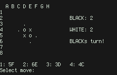
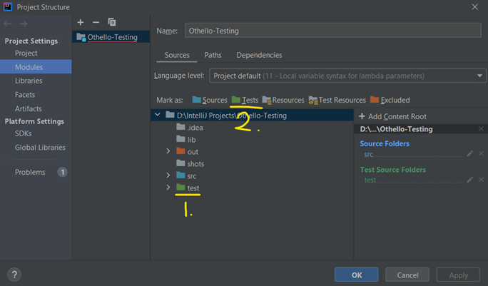

#Othello
[Othello](http://en.wikipedia.org/wiki/Othello_\(video_game\)) is a classic strategy video game based on [Reversi](http://en.wikipedia.org/wiki/Reversi). First released for Atari 2600 in 1980, later published by Acclaim Entertainment in 1988, it is similar to both chess and checkers.
 

##Gameplay
Basically, there are two sided chips (also called discs) on a board. One side is black, and one side is white. Yours are the black chips and your opponents are the white. You can play the computer or another player. The goal is to end the game with as many chips showing your color as possible. To do this, you must sandwich your opponents chip(s) between a piece (showing your own color) currently on the board, and the piece you're putting down.

##Screenshot
 

 

##Usage

	Usage: Othello [options]

		Options are:
		 cli	command line interface mode
		 gui	graphical user interface mode [default]
		 help	this help message

##License
[Othello](https://github.com/c00kiemon5ter/Othello) is licensed under [GNU GPLv3](http://www.gnu.org/licenses/gpl.txt) license. See [COPYING](https://github.com/c00kiemon5ter/Othello/blob/master/COPYING) for further information.

##Unit Testing
1. Download and install the IntelliJ IDE - Community Version
   (https://www.jetbrains.com/idea/download/#section=windows)
2. Clone this repository on to your local machine and Open the project
   (https://github.com/JungBok-Cho/Othello-Testing)
3. Go to File > Project Structure
4. Go to Libraries > Click "+" button > From Maven
5. Search using "org.junit.jupiter" and choose the 5.4.2 version, then click ok
6. Go back to the Project Structure and click Modules. Then, click the test directory and "Mark as" the Green Tests Folder above it, if the test directory is not already green.

7. Right click the test folder in the project, then, click "Run All Tests"
   (You may need to rebuild the project.)
8. After that, click the Test in the tab above and click "Run all in Othello-Testing with Coverage"  